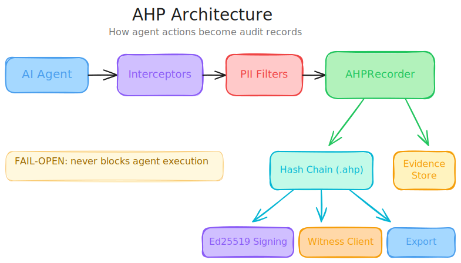
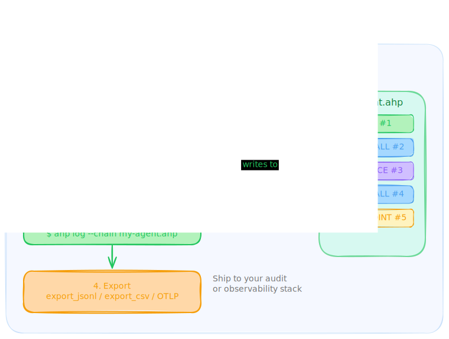

# AHP -- Agent History Protocol

The Agent History Protocol (AHP) is an open standard for tamper-evident recording of AI agent actions. Every tool call, inference, and delegation is written to a hash-chained log that anyone can verify — a flight recorder for AI agents.

<p align="center">
  
</p>

## Demo

<p align="center">
  
</p>

> Install → Run 3 real AI agents with Gemini Flash → Inspect chain records (HTTP, MCP, A2A protocols) → Verify integrity & compliance

## Documents

1. **This README** — quickstart and CLI reference
2. **[Specification](agent-history-protocol-spec.md)** — normative protocol spec for implementers

## Install

<p align="center">
  
</p>

### Python

Requires Python 3.9+.

```bash
pip install open-ahp                # core SDK
pip install open-ahp[signing]       # + Ed25519 signing (Level 2+)
pip install open-ahp[all]           # + signing, YAML config, PCRE2 filters, gRPC
```

### TypeScript / Node.js

Requires Node.js 18+.

```bash
npm install open-ahp
```

See the [TypeScript SDK README](packages/sdk-typescript/README.md) for full API docs.

## Quickstart

### Python

```python
from ahp.recorder import AHPRecorder
from ahp.core.types import Protocol, ActionType

recorder = AHPRecorder(agent_name="my-agent")
recorder.record_action(
    tool_name="read_file",
    parameters=b'{"path": "/etc/motd"}',
    result=b'"Welcome!"',
    protocol=Protocol.MCP,
    action_type=ActionType.TOOL_CALL,
)
recorder.close()
```

### TypeScript

```typescript
import { AHPRecorder, Protocol, ActionType } from "open-ahp";

const recorder = new AHPRecorder({ agentName: "my-agent" });
recorder.recordAction({
    toolName: "read_file",
    parameters: Buffer.from('{"path": "/etc/motd"}'),
    result: Buffer.from('"Welcome!"'),
    protocol: Protocol.MCP,
    actionType: ActionType.TOOL_CALL,
});
recorder.close();
```

### Auto-instrumentation

Automatically capture all HTTP calls (requests, httpx, urllib, fetch):

```python
# Python
from ahp.interceptors.http_auto import install_http_interceptor
install_http_interceptor(recorder)  # patches requests, httpx, urllib
```

```typescript
// TypeScript
import { installHttpInterceptor } from "open-ahp";
installHttpInterceptor(recorder);  // patches globalThis.fetch
```

### Inspect the log

```
$ ahp log --chain my-agent.ahp

   # | Time     | Type       | Tool/Name                 | Status  | Auth                 |  Latency
-----------------------------------------------------------------------------------------------
   1 | 14:32:01 | BOOT       | --                        | --      | --                   |       --
   2 | 14:32:01 | TOOL_CALL  | read_file                 | SUCCESS | AUTH_NONE            |     42ms
```

## CLI Commands

```
ahp log    [--chain FILE] [--last N]         Show records
ahp show   <seq> [--chain FILE] [--tree]     Show record details
ahp verify [--chain FILE]                    Verify chain integrity
ahp export [--chain FILE]                    Export as JSON
ahp trace  <session_prefix> [--chain FILE]   Trace session decisions
ahp gaps   [--chain FILE]                    List gap records
ahp init   [<agent_name>]                    Setup wizard
ahp keygen                                   Generate Ed25519 keypair
```

## Export

Export to JSONL, CSV, or OTLP (OpenTelemetry):

```python
from ahp.export import export_jsonl, export_csv, OTLPExporter

export_jsonl("my-agent.ahp", "audit.jsonl")
export_csv("my-agent.ahp", "audit.csv")

exporter = OTLPExporter(endpoint="http://localhost:4318/v1/logs")
exporter.export_chain("my-agent.ahp")
```

## Verify

```
$ ahp verify --chain my-agent.ahp

Verifying chain: my-agent
Records: 42

Checking hash chain...  ██████████████████████████████ 42/42

CHAIN VALID
   Hash chain:    42 records verified, 0 broken links
   Gaps:          0
```

## Specification

Full protocol specification: [agent-history-protocol-spec.md](agent-history-protocol-spec.md)

## License

Apache 2.0 — see [LICENSE](LICENSE).
