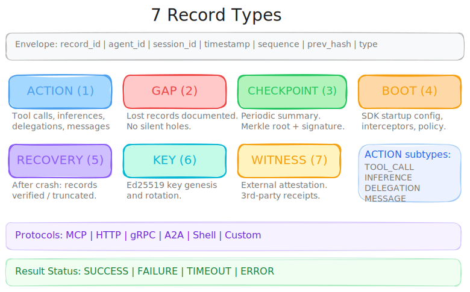
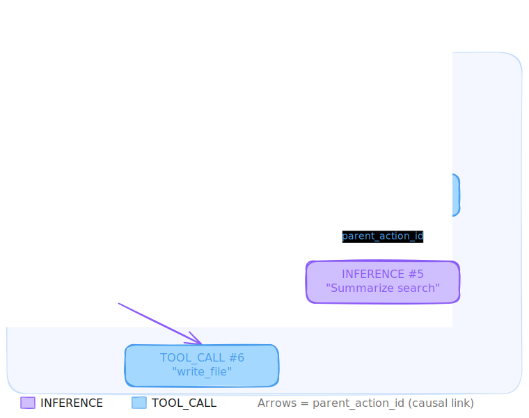
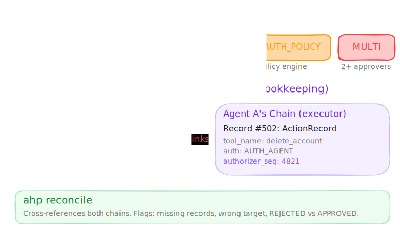
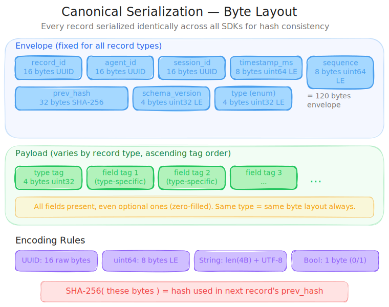
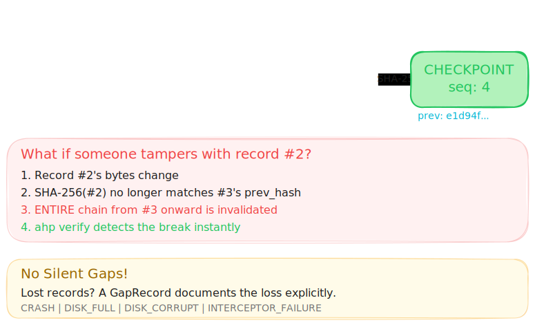
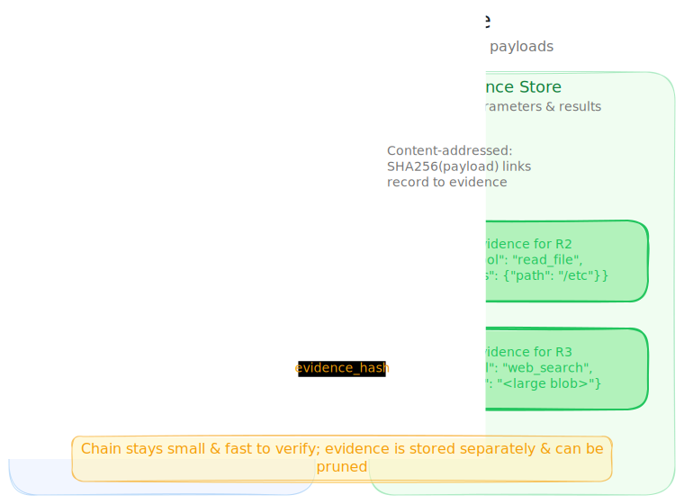
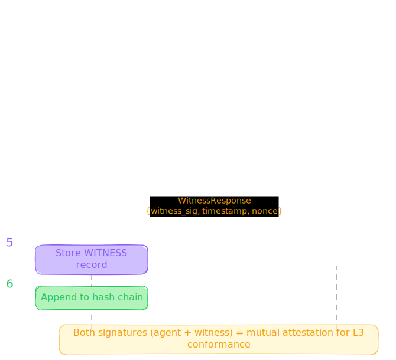
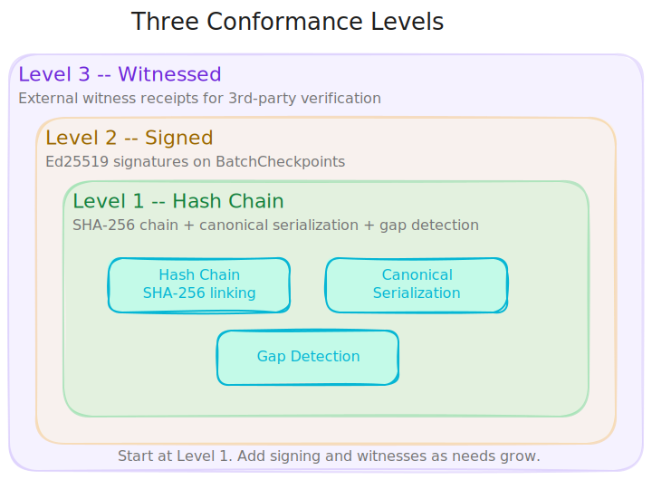

# Agent History Protocol Specification

Version 2.0 · April 2026 · Apache 2.0

---

## 1. Introduction

The Agent History Protocol (AHP) defines a standard format for recording AI agent actions as tamper-evident, hash-chained records. AHP specifies the record data model, canonical serialization, hash chain construction, evidence linking, Ed25519 signing, witness-based verification, PII filtering, authorization tracking, and conformance levels.

AHP is transport-agnostic and framework-agnostic. It defines what records look like and how they chain together. How records are captured, stored, and exported is left to SDK implementations.

### 1.1 Goals

- A single record format that works across all agent protocols (MCP, A2A, HTTP, gRPC)
- Hash chain integrity verifiable by any party with access to the chain
- Optional evidence store linking hashes to full payloads
- Optional Ed25519 signing for organizational authorship
- Optional external witnesses for independent third-party verification
- Configurable recording policy and PII filtering per agent
- Optional authorization tracking for human-in-the-loop and multi-agent approval workflows
- Cross-SDK interoperability via deterministic canonical serialization

### 1.2 Architecture Overview

The following diagram shows how AHP components fit together at runtime. Interceptors capture agent actions across protocols, PII filters redact sensitive data, and the AHPRecorder writes to a hash chain and optional evidence store. Signing, witness attestation, and export are downstream consumers of the chain.

<p align="center">
  
</p>

### 1.3 Scope

This specification defines the protocol. SDK architecture, interceptor patterns, crash recovery, CLI commands, OTLP export mapping, and framework integrations are defined in the separate SDK Implementation Guide.

---

## 2. Terminology

The key words "MUST", "MUST NOT", "REQUIRED", "SHALL", "SHALL NOT", "SHOULD", "SHOULD NOT", "RECOMMENDED", "MAY", and "OPTIONAL" in this document are to be interpreted as described in [RFC 2119](https://www.rfc-editor.org/rfc/rfc2119).

**Record:** A single AHP data unit containing an envelope and a typed payload. The atomic element of a chain.

**Chain:** An ordered sequence of records where each record's `prev_hash` contains the SHA-256 hash of the previous record's stored bytes. The tamper-evident data structure.

**Evidence:** The full payload content (parameters, results, prompts, responses) stored separately from the chain and linked by hash. Optional.

**Witness:** An independent service that receives chain state checkpoints from agents and issues signed receipts. Enables third-party verification.

**Operator:** The entity that deploys and controls the agent and its AHP SDK instance.

**Agent:** A software process that takes actions (tool calls, LLM inferences, delegations, messages) on behalf of a user or system.

**Session:** A logical grouping of actions within a single user request or conversation. Identified by `session_id` (UUID v7). A new session_id SHOULD be generated for each distinct user request or conversation. If the agent framework provides a UUID conversation or request identifier, it MAY be used as the session_id. If the framework provides a non-UUID identifier, the SDK SHOULD generate a consistent UUID v7 for the session and maintain a mapping internally. Sessions do not have an explicit end — the session_id simply stops appearing in new records. Actions from different sessions MAY interleave in the same chain.

**Inference:** An LLM API call where the agent sends a prompt and receives a response containing reasoning and/or tool use decisions. Recorded as an ActionRecord with `action_type = INFERENCE`.

**Gap:** A range of lost records documented by a GapRecord. The chain has no silent gaps — every discontinuity in sequence numbers MUST be explained by a GapRecord.

**Authorization:** A record of who approved (or rejected) an agent action. The authorizer may be a human operator, a supervisor agent, a peer agent, or an automated policy engine. Authorization captures the decision, not the execution — "who said this action is allowed" is distinct from "who performed this action."

---

## 3. Data Model

### 3.1 Common Record Envelope

All record types share a common envelope. This enables hash chain verification without understanding payload-specific fields.

| Field | Type | Description |
|-------|------|-------------|
| `record_id` | UUID v7 (16 bytes) | Unique record identifier |
| `agent_id` | UUID v7 (16 bytes) | Agent that produced the record |
| `session_id` | UUID v7 (16 bytes) | Session this record belongs to |
| `timestamp_ms` | uint64 | Wall-clock UTC milliseconds |
| `sequence` | uint64 | Monotonic per agent. No gaps except as documented by GapRecords |
| `prev_hash` | bytes[32] | SHA-256 of previous record's stored bytes. Genesis = 32 zero bytes |
| `schema_version` | uint32 | Protocol schema version |
| `type` | enum | ACTION(1), GAP(2), CHECKPOINT(3), BOOT(4), RECOVERY(5), KEY(6), WITNESS(7). Value 0 is UNSPECIFIED and MUST NOT appear in valid records |
| `payload` | oneof | Type-specific payload (see Sections 3.2–3.8) |

The following diagram shows all seven record types and how they relate to the common envelope, supported protocols, and result statuses.

<p align="center">
  
</p>

**Enum convention:** All enums in this specification reserve value 0 as UNSPECIFIED. This prevents Protobuf's default zero-value from being silently interpreted as a valid state. A record with any enum field set to 0 (UNSPECIFIED) is malformed and MUST be rejected by verifiers.

**Enum naming:** Throughout this specification, enum values are referred to by their short names (e.g., MCP, HTTP, INFERENCE). In the Protobuf schema (Appendix A), these values use prefixed names following Protobuf conventions (e.g., PROTOCOL_MCP, ACTION_INFERENCE). In JSON serialization (Appendix H), the short prose names are used (e.g., `"MCP"`, `"INFERENCE"`). Implementations MUST support mapping between all three representations.

### 3.2 ActionRecord (type = ACTION)

One agent action. The core record type.

| Field | Type | Description |
|-------|------|-------------|
| `parent_action_id` | UUID v7 (optional) | Causal parent. Links tool calls to the inference that caused them |
| `tool_name` | string | What was called. For INFERENCE: LLM API identifier (e.g., `"openai.chat.completions"`, `"anthropic.messages"`) |
| `parameters_hash` | bytes[16] | SHA-256 truncated to 128 bits, of filtered parameters payload |
| `result_hash` | bytes[16] | SHA-256 truncated to 128 bits, of filtered result payload |
| `result_status` | enum | SUCCESS, FAILURE, TIMEOUT, ERROR |
| `response_time_ms` | uint32 | Duration from request to response |
| `protocol` | enum | MCP, HTTP, GRPC, A2A, SHELL, CUSTOM |
| `action_type` | enum | TOOL_CALL, INFERENCE, DELEGATION, MESSAGE, CUSTOM |
| `target_entity` | string (optional) | What was acted on |
| `evidence_uri` | string (optional) | Where full payload is stored |
| `redacted` | bool | True if at least one PII filter matched and modified the content. False if no filters are configured or if filters were configured but no pattern matched |
| `model_id` | string (optional) | LLM model identifier. MUST be set when `action_type = INFERENCE` |
| `input_token_count` | uint32 (optional) | Prompt token count. For INFERENCE type |
| `output_token_count` | uint32 (optional) | Response token count. For INFERENCE type |
| `cache_read_tokens` | uint32 (optional) | Tokens served from prompt cache (OpenAI `cached_tokens`, Anthropic `cache_read_input_tokens`) |
| `cache_creation_tokens` | uint32 (optional) | Tokens written to prompt cache (Anthropic `cache_creation_input_tokens`) |
| `reasoning_tokens` | uint32 (optional) | Internal reasoning/thinking tokens consumed by the model (OpenAI o-series `reasoning_tokens`, Gemini `thoughtsTokenCount`, DeepSeek-R1) |
| `cost_nano_usd` | uint64 (optional) | Pre-calculated cost in nano USD (1 USD = 1,000,000,000 nano USD). Auto-estimated from configurable pricing table if not provided. User-supplied values take priority |
| `provider` | string (optional) | LLM provider identifier: `"openai"`, `"anthropic"`, `"google"`, `"azure-openai"`, `"aws-bedrock"`, `"google-vertex"`, `"groq"`, `"deepseek"`, etc. Auto-detected from endpoint URL |
| `authorization` | Authorization | Who approved this action. AUTH_NONE when no authorization applies. See Section 3.9 |

**Inference semantics:** When `action_type = INFERENCE`, the record captures an LLM reasoning step. `parameters_hash` covers the prompt sent to the LLM. `result_hash` covers the full response including reasoning/thinking tokens. Tool calls resulting from the inference MUST set `parent_action_id` to the INFERENCE record's `record_id`. Sequential INFERENCE records in the same session SHOULD set `parent_action_id` to the most recent prior INFERENCE record (conversational continuity).

`parent_action_id` means "the action that most directly caused this action to happen."

<p align="center">
  
</p>

**Streaming responses:** For streaming LLM responses, the INFERENCE ActionRecord MUST be emitted after the complete response has been received. `result_hash` covers the fully assembled response, not individual stream chunks.

**When `inference.record = false`:** LLM API calls MUST be silently skipped by the interceptor — no record is emitted. They are not recorded as TOOL_CALL or any other action_type. The BootRecord's `inference_recording = false` documents this policy. An auditor seeing no INFERENCE records checks the BootRecord to confirm this was configured, not a gap.

**Interceptor failure:** AHP MUST be fail-open — if the SDK encounters an error during recording (serialization failure, disk full, OOM), the agent's action MUST still proceed. The SDK SHOULD log the failure internally and emit a GapRecord with `reason = INTERCEPTOR_FAILURE` when it recovers. AHP is an audit system, not a control system — it MUST NOT block agent execution.

### 3.3 GapRecord (type = GAP)

Explicit documentation of lost records.

| Field | Type | Description |
|-------|------|-------------|
| `first_lost_sequence` | uint64 | First sequence number that was lost |
| `last_lost_sequence` | uint64 | Last sequence number that was lost |
| `count` | uint64 | Number of lost records |
| `reason` | enum | CRASH, DISK_FULL, DISK_CORRUPT, ROTATION, INTERCEPTOR_FAILURE, BACKPRESSURE, MANUAL_PURGE |
| `detail` | string (optional) | Human-readable context |

**Sequence numbering:** A GapRecord's `sequence` (in the envelope) MUST equal `last_lost_sequence + 1`. The next record after the GapRecord continues from `sequence + 1`.

Example: if record 4 is the last valid record and records 5-10 are lost, the GapRecord has `sequence=11`, `first_lost_sequence=5`, `last_lost_sequence=10`, `count=6`. The next regular record has `sequence=12`.

**Constraints:** `count` MUST equal `last_lost_sequence - first_lost_sequence + 1`. `first_lost_sequence` MUST be greater than the previous record's sequence.

### 3.4 BatchCheckpoint (type = CHECKPOINT)

Periodic chain summary.

| Field | Type | Description |
|-------|------|-------------|
| `record_count` | uint64 | Total records in chain (including this checkpoint) |
| `gap_count` | uint64 | Total GapRecords in chain |
| `chain_hash` | bytes[32] | Hash of the chain head at checkpoint time. Equal to this record's `prev_hash`. Intentionally redundant — provides the value sent to witnesses (Section 8) without requiring envelope parsing |
| `merkle_root` | bytes[32] (optional) | RFC 6962 Merkle tree root of all records since last checkpoint |
| `signature` | bytes[64] (optional) | Ed25519 signature over `merkle_root`. Required at Level 2+ |
| `signing_key_id` | bytes[32] (optional) | SHA-256 fingerprint of the signing key |
| `evidence_status` | object | `{ available: uint64, exported: uint64, expired: uint64, missing: uint64 }` |

### 3.5 BootRecord (type = BOOT)

Emitted at SDK startup and on configuration change. Documents what is being monitored and what recording policy is active.

| Field | Type | Description |
|-------|------|-------------|
| `sdk_name` | string | SDK identifier (e.g., `"ahp-python"`, `"ahp-typescript"`) |
| `sdk_version` | string | Semver version |
| `interceptors` | repeated string | Active interceptors (e.g., `["mcp", "http", "grpc"]`) |
| `agent_framework` | string (optional) | Framework name (e.g., `"langchain"`, `"crewai"`) |
| `agent_name` | string | Human-readable agent identifier |
| `runtime` | string | Runtime environment (e.g., `"python 3.12"`, `"node 22.1"`) |
| `chain_level` | enum | LEVEL_1, LEVEL_2, LEVEL_3 |
| `fsync_mode` | enum | EVERY, BATCH, NONE |
| `clock_source` | string (optional) | Clock source (e.g., `"ntp:pool.ntp.org"`, `"system"`) |
| `inference_recording` | bool | Whether INFERENCE records are being emitted |
| `inference_evidence` | bool | Whether full prompts/responses are stored |
| `evidence_recording` | bool | Whether tool call payloads are stored |
| `filter_config_hash` | bytes[32] | SHA-256 of canonical filter config. 32 zero bytes if no filters |
| `matched_agent_rule` | string (optional) | Which per-agent config rule matched (glob pattern) |
| `config_source` | string (optional) | Config origin (e.g., `"ahp.yaml"`, `"env"`, `"programmatic"`) |
| `authorization_recording` | bool | Whether authorization context is being recorded on ActionRecords |

### 3.6 RecoveryRecord (type = RECOVERY)

Emitted after crash recovery.

| Field | Type | Description |
|-------|------|-------------|
| `records_verified` | uint64 | Records verified during recovery |
| `records_truncated` | uint64 | Records truncated (corrupt trailing records) |
| `last_valid_seq` | uint64 | Last verified sequence number |
| `recovery_method` | enum | CHECKPOINT_FILE, CHAIN_SCAN, FRESH_START |
| `detail` | string | Human-readable recovery summary |

**Post-crash ordering:** After a crash that causes both data loss and recovery, the SDK MUST emit records in this order:

1. **RecoveryRecord first** — documents what recovery found (how many records verified, how many truncated, what method was used). Its `sequence` is `last_valid_seq + 1`.
2. **GapRecord second** — documents what was lost (the range of unrecoverable records). Its `sequence` follows the GapRecord rules in Section 3.3.

If recovery finds no data loss (all records intact), only a RecoveryRecord is emitted. If recovery cannot determine the exact lost range, the GapRecord's `count` is a best-effort estimate and `detail` SHOULD explain the uncertainty.

### 3.7 KeyGenesisRecord (type = KEY)

Establishes or rotates signing identity.

| Field | Type | Description |
|-------|------|-------------|
| `public_key` | bytes[32] | Ed25519 public key |
| `key_id` | bytes[32] | SHA-256 of `public_key` |
| `expires_at` | uint64 (optional) | Key expiration timestamp (ms UTC) |
| `supersedes_key_id` | bytes[32] (optional) | Key being rotated out. Set for key rotation |

**Key rotation handoff:** When `supersedes_key_id` is set, this record rotates from an old key to a new key. The BatchCheckpoint immediately following a rotation MUST be signed by the old key. The next BatchCheckpoint after that MUST be signed by the new key. This provides a signed handoff: the old key's last checkpoint covers the rotation record, and the new key's first checkpoint proves continuity.

### 3.8 WitnessReceipt (type = WITNESS)

External attestation stored in the chain.

| Field | Type | Description |
|-------|------|-------------|
| `witness_id` | string | Identifier of the witness service |
| `checkpoint_seq` | uint64 | Sequence number that was checkpointed |
| `checkpoint_hash` | bytes[32] | Chain head hash at the checkpointed sequence |
| `witness_timestamp` | uint64 | Witness's own clock (ms UTC) |
| `receipt_signature` | bytes[64] | Witness's Ed25519 signature over the checkpoint + witness_timestamp |
| `witness_public_key` | bytes[32] | Witness's Ed25519 public key |

### 3.9 Authorization Model

Authorization records who approved (or rejected) an agent action before it was executed. This is distinct from causation (`parent_action_id`), which records what triggered an action. Causation answers "what decided to do this?" — authorization answers "who allowed it?"

<p align="center">
  
</p>

#### 3.9.1 Authorization Object

The `authorization` field on ActionRecord is a required nested message. Every ActionRecord MUST set `authorization.type` to a valid value. When no authorization applies, set `type = AUTH_NONE`.

| Field | Type | Description |
|-------|------|-------------|
| `type` | enum | AUTH_NONE, AUTH_HUMAN, AUTH_AGENT, AUTH_POLICY, AUTH_MULTI_PARTY |
| `entries` | repeated AuthorizationEntry | One entry per authorizer. Empty when `type = AUTH_NONE` |

**Type semantics:**

| Type | Entries | Meaning |
|------|---------|---------|
| `AUTH_NONE` | 0 (MUST be empty) | Action required no authorization or was auto-approved |
| `AUTH_HUMAN` | exactly 1 | A human operator approved this action |
| `AUTH_AGENT` | exactly 1 | A supervisor or peer agent approved this action |
| `AUTH_POLICY` | exactly 1 | An automated policy engine approved this action |
| `AUTH_MULTI_PARTY` | 2 or more | Multiple authorizers were required. Entries MAY mix authorizer types |

#### 3.9.2 AuthorizationEntry

Each entry represents one authorizer's decision:

| Field | Type | Description |
|-------|------|-------------|
| `authorizer_type` | enum | AUTHORIZER_HUMAN, AUTHORIZER_AGENT, AUTHORIZER_POLICY_ENGINE |
| `authorizer_id` | string | Human-readable identifier. For humans: email or username (e.g., `"john@company.com"`). For agents: agent name (e.g., `"supervisor-bot"`). For policies: policy name (e.g., `"production-access-policy"`) |
| `authorizer_agent_id` | UUID v7 (optional) | For agent authorizers: their `agent_id`. Enables cross-chain linking. MUST be set when `authorizer_type = AUTHORIZER_AGENT` |
| `authorizer_seq` | uint64 (optional) | Sequence number in the authorizer agent's chain where the approval/rejection was recorded. Enables cross-chain verification. SHOULD be set when `authorizer_type = AUTHORIZER_AGENT` |
| `decision` | enum | APPROVED, REJECTED, CONDITIONAL |
| `condition` | string (optional) | Condition text when `decision = CONDITIONAL` (e.g., `"only for accounts inactive > 90 days"`). MUST be empty when decision is APPROVED or REJECTED |
| `timestamp_ms` | uint64 | When the authorization decision was made (ms UTC). For humans: when they clicked approve. For agents: timestamp of their approval record |

**PII consideration:** The `authorizer_id` value is stored in the chain's canonical bytes, not in the evidence store. PII filters (Section 10.2) do not apply to record fields — only to evidence payloads. Operators with PII requirements SHOULD use opaque identifiers (e.g., `"user:a3f8b2"`, internal usernames) rather than email addresses or other personal data in `authorizer_id`. Once written to the chain, the value cannot be redacted without breaking hash integrity.

#### 3.9.3 Cross-Chain Verification (Double-Entry Bookkeeping)

When an agent authorizes another agent's action, both chains record the event:

```
Agent B's chain (authorizer):
  Record #4821: ActionRecord {
      action_type: MESSAGE
      tool_name:   "authorization_decision"
      target_entity: "agent:planner-bot"
      // parameters_hash covers the request details
      // result_hash covers the decision (APPROVED + any conditions)
  }

Agent A's chain (executor):
  Record #502: ActionRecord {
      action_type: TOOL_CALL
      tool_name:   "delete_account"
      authorization: {
          type: AUTH_AGENT
          entries: [{
              authorizer_type:     AUTHORIZER_AGENT
              authorizer_id:       "supervisor-bot"
              authorizer_agent_id: <Agent B's agent_id>
              authorizer_seq:      4821
              decision:            APPROVED
              timestamp_ms:        1710684000000
          }]
      }
  }
```

**Verification:** `ahp reconcile` cross-references `authorizer_agent_id` + `authorizer_seq` in Agent A's chain against the actual record at sequence 4821 in Agent B's chain. If Agent B's record doesn't exist, has a different `target_entity`, or shows REJECTED instead of APPROVED — the discrepancy is flagged.

#### 3.9.4 Rejected Actions

When authorization is rejected, the agent SHOULD still emit an ActionRecord to document the attempt:

- `result_status` = ERROR
- `authorization.entries[].decision` = REJECTED
- `response_time_ms` = 0 (action was not executed)
- `parameters_hash` covers what was requested
- `result_hash` = 16 zero bytes (no result produced)

This enables auditors to answer: "How many times did this agent attempt unauthorized actions?"

#### 3.9.5 Multi-Party Authorization

For high-risk actions requiring multiple approvers:

```
authorization: {
    type: AUTH_MULTI_PARTY
    entries: [
        {
            authorizer_type: AUTHORIZER_AGENT
            authorizer_id:   "safety-checker"
            authorizer_agent_id: <safety agent UUID>
            authorizer_seq:  331
            decision:        APPROVED
            timestamp_ms:    1710683990000
        },
        {
            authorizer_type: AUTHORIZER_HUMAN
            authorizer_id:   "john@company.com"
            decision:        APPROVED
            timestamp_ms:    1710684000000
        }
    ]
}
```

When `type = AUTH_MULTI_PARTY`, agent frameworks SHOULD NOT execute the action unless all entries have `decision = APPROVED` or `decision = CONDITIONAL` (with conditions met). Enforcement of multi-party authorization policies is the responsibility of the agent framework, not the recording protocol. If any entry has `decision = REJECTED`, the ActionRecord SHOULD be emitted with `result_status = ERROR` to document the denied attempt.

#### 3.9.6 AUTH_NONE and Authorization Recording

`AUTH_NONE` means "no authorization was required for this action." When `authorization_recording = false` in the BootRecord, the SDK defaults all ActionRecords to `AUTH_NONE` — the field is present but not meaningfully populated. When `authorization_recording = true`, the SDK actively tracks authorization and `AUTH_NONE` is a deliberate statement that no approval was needed.

Auditors check `authorization_recording` in the BootRecord to know whether the values are meaningful.

### 3.10 Maximum Field and Record Sizes

Implementations SHOULD enforce the following maximum sizes to ensure interoperability:

| Field | RECOMMENDED Maximum |
|-------|-------------------|
| `tool_name` | 1024 bytes |
| `target_entity` | 4096 bytes |
| `detail` | 4096 bytes |
| `condition` | 4096 bytes |
| `authorizer_id` | 256 bytes |
| Total record (canonical bytes) | 1 MB (1,048,576 bytes) |

Records exceeding these limits MAY be rejected by verifiers and witnesses. SDKs SHOULD truncate or reject oversized fields before recording.

---

## 4. Canonical Serialization

Hash chain integrity requires that any conformant implementation produces identical bytes for the same logical record. This section defines the canonical byte representation used for hashing.

<p align="center">
  
</p>

### 4.1 Rules

1. All fields are serialized in **strictly ascending tag number order** as assigned in the Protobuf schema (Appendix A).
2. Integers (uint32, uint64) are encoded as **fixed-width little-endian** (4 bytes for uint32, 8 bytes for uint64).
3. Strings are encoded as **UTF-8 bytes with a uint32 length prefix** (4 bytes LE length + string bytes). Empty strings are encoded as 4 zero bytes (length 0).
4. UUIDs are encoded as **16 raw bytes** (binary UUID, no dashes, no string encoding). Unset optional UUIDs are encoded as 16 zero bytes.
5. Fixed-length byte arrays (hashes, keys, signatures) are encoded as **raw bytes at their defined length**, with no length prefix. `prev_hash` is always 32 bytes. `parameters_hash` and `result_hash` are always 16 bytes. `signature` is always 64 bytes. Unset optional byte arrays are zero-filled to their defined length.
6. Booleans are encoded as **1 byte** (0x00 = false, 0x01 = true).
7. Enums are encoded as **uint32 little-endian** using their Protobuf numeric values. Value 0 (UNSPECIFIED) MUST NOT appear in valid records.
8. **Every field is present in the canonical representation**, including optional fields. Unset optional fields use their zero value: 0 for integers/enums, 0x00 for bools, 16 zero bytes for UUIDs, zero-filled bytes for fixed-length byte arrays, uint32 length prefix of 0 for strings. This ensures every record of the same type has the same byte layout.
9. Repeated fields are encoded as **uint32 count prefix** followed by each element serialized per these rules.
10. The `payload` oneof is serialized as: **uint32 type tag** (matching the envelope `type` enum value) followed by the payload fields in ascending tag order.
11. **Nested messages** (e.g., `EvidenceStatus` inside `CheckpointPayload`) are serialized inline — their fields appear in ascending tag order at the point of the parent field, without a length prefix. Nested field tags are scoped to their parent (e.g., `evidence_status.available` is tag 7.1 in the canonical serialization, serialized as the uint64 value directly after the parent's preceding field).

### 4.2 stored_bytes = canonical_bytes

Records MUST be stored in canonical byte order. The stored bytes on disk ARE the canonical representation. This means:

- **Construction:** When a writer creates a record, it serializes all fields per the rules above.
- **Verification:** When a verifier checks the chain, it hashes the stored bytes directly. No re-serialization or field-level parsing is required.
- **Reading:** Canonical bytes are not human-readable. SDKs MUST provide conversion from canonical binary to the JSON record format (Appendix H) for human inspection. The CLI (`ahp log`, `ahp show`, `ahp export --format json`) is the primary reading interface.
- **Forward compatibility:** A verifier that encounters an unknown record type can still verify the hash chain by hashing the stored bytes without parsing the payload.

### 4.3 Pseudocode

```
function canonical_bytes(record):
    buf = empty byte buffer

    // Envelope fields (ascending tag order)
    buf.append_uuid(record.record_id)           // tag 1: 16 bytes
    buf.append_uuid(record.agent_id)            // tag 2: 16 bytes
    buf.append_uuid(record.session_id)          // tag 3: 16 bytes
    buf.append_uint64_le(record.timestamp_ms)   // tag 4: 8 bytes
    buf.append_uint64_le(record.sequence)        // tag 5: 8 bytes
    buf.append_bytes(record.prev_hash, 32)      // tag 6: 32 bytes
    buf.append_uint32_le(record.schema_version) // tag 7: 4 bytes
    buf.append_uint32_le(record.type)           // tag 8: 4 bytes (enum as uint32)

    // Payload (type tag + fields in ascending tag order)
    buf.append_uint32_le(record.type)           // payload type discriminator
    switch record.type:
        case ACTION:
            buf.append_optional_uuid(record.payload.parent_action_id)  // tag 1
            buf.append_string(record.payload.tool_name)                // tag 2
            buf.append_bytes(record.payload.parameters_hash, 16)       // tag 3
            buf.append_bytes(record.payload.result_hash, 16)           // tag 4
            buf.append_uint32_le(record.payload.result_status)         // tag 5
            buf.append_uint32_le(record.payload.response_time_ms)      // tag 6
            buf.append_uint32_le(record.payload.protocol)              // tag 7
            buf.append_uint32_le(record.payload.action_type)           // tag 8
            buf.append_string(record.payload.target_entity)            // tag 9
            buf.append_string(record.payload.evidence_uri)             // tag 10
            buf.append_bool(record.payload.redacted)                   // tag 11
            buf.append_string(record.payload.model_id)                 // tag 12
            buf.append_uint32_le(record.payload.input_token_count)     // tag 13
            buf.append_uint32_le(record.payload.output_token_count)    // tag 14
            buf.append_uint32_le(record.payload.cache_read_tokens)     // tag 15
            buf.append_uint32_le(record.payload.cache_creation_tokens) // tag 16
            buf.append_uint32_le(record.payload.reasoning_tokens)      // tag 17
            buf.append_uint64_le(record.payload.cost_nano_usd)        // tag 18
            buf.append_string(record.payload.provider)                 // tag 19
            // Authorization (tag 20) — nested message, serialized inline
            buf.append_uint32_le(record.payload.authorization.type)    // tag 20.1
            buf.append_uint32_le(len(record.payload.authorization.entries))  // tag 20.2 count
            for entry in record.payload.authorization.entries:
                buf.append_uint32_le(entry.authorizer_type)            // tag 20.2.1
                buf.append_string(entry.authorizer_id)                 // tag 20.2.2
                buf.append_optional_uuid(entry.authorizer_agent_id)    // tag 20.2.3
                buf.append_uint64_le(entry.authorizer_seq)             // tag 20.2.4
                buf.append_uint32_le(entry.decision)                   // tag 20.2.5
                buf.append_string(entry.condition)                     // tag 20.2.6
                buf.append_uint64_le(entry.timestamp_ms)               // tag 20.2.7
        case GAP:
            buf.append_uint64_le(record.payload.first_lost_sequence)   // tag 1
            buf.append_uint64_le(record.payload.last_lost_sequence)    // tag 2
            buf.append_uint64_le(record.payload.count)                 // tag 3
            buf.append_uint32_le(record.payload.reason)                // tag 4
            buf.append_string(record.payload.detail)                   // tag 5
        case CHECKPOINT:
            buf.append_uint64_le(record.payload.record_count)          // tag 1
            buf.append_uint64_le(record.payload.gap_count)             // tag 2
            buf.append_bytes(record.payload.chain_hash, 32)            // tag 3
            buf.append_bytes(record.payload.merkle_root, 32)           // tag 4
            buf.append_bytes(record.payload.signature, 64)             // tag 5
            buf.append_bytes(record.payload.signing_key_id, 32)        // tag 6
            buf.append_uint64_le(record.payload.evidence_status.available)  // tag 7.1
            buf.append_uint64_le(record.payload.evidence_status.exported)   // tag 7.2
            buf.append_uint64_le(record.payload.evidence_status.expired)    // tag 7.3
            buf.append_uint64_le(record.payload.evidence_status.missing)    // tag 7.4
        case BOOT:
            buf.append_string(record.payload.sdk_name)                 // tag 1
            buf.append_string(record.payload.sdk_version)              // tag 2
            buf.append_repeated_string(record.payload.interceptors)    // tag 3
            buf.append_string(record.payload.agent_framework)          // tag 4
            buf.append_string(record.payload.agent_name)               // tag 5
            buf.append_string(record.payload.runtime)                  // tag 6
            buf.append_uint32_le(record.payload.chain_level)           // tag 7
            buf.append_uint32_le(record.payload.fsync_mode)            // tag 8
            buf.append_string(record.payload.clock_source)             // tag 9
            buf.append_bool(record.payload.inference_recording)        // tag 10
            buf.append_bool(record.payload.inference_evidence)         // tag 11
            buf.append_bool(record.payload.evidence_recording)         // tag 12
            buf.append_bytes(record.payload.filter_config_hash, 32)    // tag 13
            buf.append_string(record.payload.matched_agent_rule)       // tag 14
            buf.append_string(record.payload.config_source)            // tag 15
            buf.append_bool(record.payload.authorization_recording)    // tag 16
        case RECOVERY:
            buf.append_uint64_le(record.payload.records_verified)      // tag 1
            buf.append_uint64_le(record.payload.records_truncated)     // tag 2
            buf.append_uint64_le(record.payload.last_valid_seq)        // tag 3
            buf.append_uint32_le(record.payload.recovery_method)       // tag 4
            buf.append_string(record.payload.detail)                   // tag 5
        case KEY:
            buf.append_bytes(record.payload.public_key, 32)            // tag 1
            buf.append_bytes(record.payload.key_id, 32)                // tag 2
            buf.append_uint64_le(record.payload.expires_at)            // tag 3
            buf.append_bytes(record.payload.supersedes_key_id, 32)     // tag 4
        case WITNESS:
            buf.append_string(record.payload.witness_id)               // tag 1
            buf.append_uint64_le(record.payload.checkpoint_seq)        // tag 2
            buf.append_bytes(record.payload.checkpoint_hash, 32)       // tag 3
            buf.append_uint64_le(record.payload.witness_timestamp)     // tag 4
            buf.append_bytes(record.payload.receipt_signature, 64)     // tag 5
            buf.append_bytes(record.payload.witness_public_key, 32)    // tag 6

    return buf.bytes()

// Helper functions:

function append_string(buf, s):
    bytes = utf8_encode(s)          // empty string → 0 bytes
    buf.append_uint32_le(len(bytes))
    buf.append(bytes)

function append_bytes(buf, b, expected_len):
    if b is not set:
        buf.append(0x00 * expected_len)   // zero-fill unset byte fields
    else:
        assert len(b) == expected_len
        buf.append(b)

function append_optional_uuid(buf, uuid):
    if uuid is not set:
        buf.append(0x00 * 16)            // 16 zero bytes for unset UUID
    else:
        buf.append(uuid.bytes)           // 16 raw bytes

function append_repeated_string(buf, strings):
    buf.append_uint32_le(len(strings))   // count prefix
    for s in strings:
        append_string(buf, s)
```

### 4.4 Schema Versioning

The `schema_version` field in the common envelope identifies which version of this specification the record conforms to. This specification defines `schema_version = 2`.

**Version history:**

- `schema_version = 1` — pre-1.0 draft. ActionPayload tags 1–14 only; omits `cache_read_tokens`, `cache_creation_tokens`, `reasoning_tokens`, `cost_nano_usd`, `provider`. Reserved; no longer produced by reference implementations.
- `schema_version = 2` — current. ActionPayload extends v1 with the five fields above at tags 15–19, followed by the Authorization block at tag 20. All other record types are unchanged from v1.

**Versioning rules:**

- **Minor additions** (new optional fields appended to a payload) do not change `schema_version`. Existing verifiers ignore unknown trailing bytes in canonical serialization.
- **Breaking changes** (field type changes, field reordering, field removal, semantic changes) increment `schema_version`.
- SDKs MUST be able to **verify the hash chain** of any record regardless of `schema_version` (by hashing stored bytes).
- SDKs MUST be able to **parse and interpret** records with `schema_version` less than or equal to their supported version.
- SDKs SHOULD emit a warning for records with `schema_version` greater than their supported version but MUST still verify the hash chain.

This ensures forward compatibility for verification and backward compatibility for interpretation.

---

## 5. Hash Chain

### 5.1 Hash Algorithm

SHA-256 is used for all hashing operations:

- **Chain integrity:** Full 256-bit SHA-256 for `prev_hash`.
- **Content hashing:** SHA-256 truncated to the first 128 bits (16 bytes) for `parameters_hash` and `result_hash`.
- **Key identification:** Full 256-bit SHA-256 for `key_id` (hash of public key).

One algorithm everywhere. FIPS 140-2 compliant.

### 5.2 Genesis

The first record in a chain has:

```
prev_hash = 0x0000000000000000000000000000000000000000000000000000000000000000
sequence = 1
```

### 5.3 Chaining

For each subsequent record:

```
Record_N.prev_hash = SHA-256(stored_bytes(Record_{N-1}))
```

Where `stored_bytes` is the record's on-disk representation, which equals its canonical serialization (Section 4.2).

The following diagram visualizes how records chain together via SHA-256 hashes, how tampering is detected, and how GapRecords document lost records.

<p align="center">
  
</p>

### 5.4 Verification Algorithm

```
function verify_chain(records):
    expected_seq = 1
    for i in 0..len(records)-1:
        record = records[i]

        // Verify hash chain
        if i == 0:
            assert record.prev_hash == ZERO_BYTES_32
        else:
            assert record.prev_hash == SHA-256(stored_bytes(records[i-1]))

        // Verify sequence
        if record.type == GAP:
            assert record.sequence > expected_seq
            assert record.payload.first_lost_sequence == expected_seq
            assert record.payload.last_lost_sequence == record.sequence - 1
            assert record.payload.count == record.payload.last_lost_sequence
                                          - record.payload.first_lost_sequence + 1
        else:
            assert record.sequence == expected_seq

        expected_seq = record.sequence + 1

    return VALID
```

---

## 6. Evidence Model

### 6.1 Content-Addressed Linking

The chain stores hashes. The evidence store stores content. They are linked by hash.

<p align="center">
  
</p>

```
Chain:     ActionRecord { parameters_hash: 0xa1b2c3d4... }
                              |
Evidence:  evidence/a1b2c3d4e5f6a7b8c9d0e1f2a3b4c5d6  (file named by hex hash)
```

- Evidence files MUST be content-addressed: `filename = hex(hash)` where hash is the same truncated 128-bit SHA-256 used in the ActionRecord.
- Evidence files contain the raw bytes that were hashed (after PII filtering, if configured).
- `evidence_uri` in ActionRecord MAY point to a retrieval location (local path, S3 URI, HTTP URL).
- `redacted: true` signals the hash was computed over filtered content, not the original.
- Evidence recording is OPTIONAL. Operators configure it globally and per-agent.

### 6.2 Evidence Status

| Status | Meaning |
|--------|---------|
| AVAILABLE | Evidence exists locally or at `evidence_uri` |
| EXPORTED | Evidence shipped to external store; local copy may be deleted |
| EXPIRED | Evidence deleted per retention policy; hash remains in chain |
| ERASED | Evidence deleted per privacy/GDPR request |
| MISSING | Evidence expected but not found (verification failure) |

BatchCheckpoints include evidence status counts to enable monitoring.

### 6.3 Evidence Verification

`ahp verify --evidence` SHOULD:
1. For each ActionRecord with `evidence_recording = true` (per active BootRecord):
2. Locate the evidence file by `parameters_hash` and `result_hash`
3. Verify `SHA-256-truncated-128(file_contents) == hash_in_record`
4. Report status counts: available, exported, expired, erased, missing

---

## 7. Signing

### 7.1 Key Identification

Before signing any record, the SDK MUST emit a KeyGenesisRecord containing the Ed25519 public key. `key_id` is computed as `SHA-256(public_key)`.

### 7.2 BatchCheckpoint Signing

At Level 2+, BatchCheckpoints MUST include:
- `merkle_root`: RFC 6962 Merkle tree root of all records since the last checkpoint
- `signature`: Ed25519 signature over `merkle_root`
- `signing_key_id`: The `key_id` of the signing key

**Merkle tree construction:** The Merkle tree follows RFC 6962 Section 2.1:

- **Leaf nodes:** `SHA-256(0x00 || canonical_bytes(record))` for each record since the last checkpoint.
- **Internal nodes:** `SHA-256(0x01 || left_child || right_child)`.
- **Empty tree:** If no records have been emitted since the last checkpoint, `merkle_root` MUST be 32 zero bytes (`0x00 * 32`).
- **Signature input:** The Ed25519 signature covers the `merkle_root` bytes directly (32 bytes, no additional framing).

Verification: look up the public key from the most recent KeyGenesisRecord with matching `key_id`, verify the Ed25519 signature over `merkle_root`.

### 7.3 Key Rotation

To rotate keys, emit a KeyGenesisRecord with `supersedes_key_id` set to the old key's `key_id`.

Handoff protocol:
1. Emit KeyGenesisRecord with new public key and `supersedes_key_id`
2. The next BatchCheckpoint MUST be signed by the **old** key (covers the rotation record)
3. The BatchCheckpoint after that MUST be signed by the **new** key (proves continuity)

After step 3, the old key is retired. Both checkpoints create a signed handoff that auditors can verify.

---

## 8. Witness Protocol

### 8.1 Checkpoint API

Witnesses are independent services that receive chain state and issue signed receipts.

<p align="center">
  
</p>

**POST /ahp/v1/checkpoints**

Request:
| Field | Type | Description |
|-------|------|-------------|
| `agent_id` | string (UUID) | Agent identity |
| `chain_hash` | string (hex, 64 chars) | Current chain head hash |
| `sequence` | uint64 | Current sequence number |
| `timestamp_ms` | uint64 | Agent's clock |
| `signing_key_id` | string (hex) | SHA-256 of the public key used to sign |
| `public_key` | string (hex) | Agent's Ed25519 public key (32 bytes, hex-encoded) |
| `signature` | string (hex) | Agent's Ed25519 signature — see below |

The agent MUST produce `signature` as the Ed25519 signature over the canonical JSON of the six fields `{agent_id, chain_hash, sequence, timestamp_ms, signing_key_id, public_key}`. The canonicalisation rules (below) apply to every signed blob in the witness protocol, both request and response. Binding `signing_key_id` and `public_key` into the signed blob prevents a captured signature from being replayed with a substituted key identity. Witnesses MUST reconstruct the identical blob from the request body and verify before accepting the checkpoint.

**Canonical JSON rules for witness signatures:**

- UTF-8 encoded output.
- Keys sorted lexicographically by Unicode code point.
- No insignificant whitespace: element separator is exactly `,`, key-value separator is exactly `:`.
- String values are enclosed in `"`; our fields are ASCII-only (hex or UUID strings), so no escaping decisions arise in practice.
- Integers rendered as their shortest decimal form (no leading zeros, no `+` sign, no decimal point, no exponent).
- Values MUST NOT be `null`, floats, nested objects, or arrays — all witness-protocol fields are strings or uint64 integers.

This is a strict subset of RFC 8785 (JSON Canonicalization Scheme); any conformant JCS library produces the same bytes for these inputs. Reference implementations:

- Python: `json.dumps(obj, sort_keys=True, separators=(",", ":"))`
- JavaScript/TypeScript: `JSON.stringify` does NOT sort keys; implementations MUST sort before stringifying (or use a JCS library).

Response:
| Field | Type | Description |
|-------|------|-------------|
| `receipt_id` | string (UUID) | Unique receipt identifier |
| `witness_id` | string | Witness identity |
| `witness_timestamp` | uint64 | Witness's own clock (ms UTC) |
| `witness_signature` | string (hex) | Witness's Ed25519 signature over `{agent_id, chain_hash, sequence, witness_timestamp}`, canonicalised by the rules above |
| `witness_public_key` | string (hex, 64 chars) | Witness's Ed25519 public key for verifying `witness_signature` |

**GET /ahp/v1/receipts/{receipt_id}**

Returns the full receipt including the original checkpoint data (agent_id, chain_hash, sequence, timestamp_ms) and the witness response fields.

**GET /ahp/v1/agents/{agent_id}/checkpoints?after_seq=N**

Returns an array of receipts for the given agent with `sequence > N`.

**GET /ahp/v1/identity**

Returns the witness's public key and identity information for trust establishment.

**Error Responses:**

All witness API endpoints MUST return appropriate HTTP status codes on failure:

| Status | Meaning | When |
|--------|---------|------|
| 400 | Bad Request | Missing required fields or malformed request body |
| 401 | Unauthorized | Invalid or missing agent signature |
| 404 | Not Found | Receipt ID or agent ID does not exist |
| 409 | Conflict | Duplicate checkpoint (same `agent_id` + `sequence` already recorded) |
| 413 | Payload Too Large | Request body exceeds witness size limit |
| 429 | Too Many Requests | Rate limited; client SHOULD retry with exponential backoff |
| 503 | Service Unavailable | Witness temporarily unavailable; client SHOULD retry |

Error response body MUST include a JSON object with `error` (string, machine-readable code) and `message` (string, human-readable description).

### 8.2 Guarantees

- A receipt proves: "Witness W observed that Agent A claimed chain state H at sequence N, and W recorded this at time T."
- The agent's signature on the checkpoint prevents the witness from fabricating checkpoints.
- The witness's signature on the receipt prevents the agent from fabricating receipts.
- Both sides have non-repudiable evidence of the exchange.

### 8.3 Trust Properties

- A witnessed checkpoint makes it impossible for the operator to reduce the record count below N or rewrite history before sequence N — without the discrepancy being detectable.
- Multiple independent witnesses make collusion progressively harder.
- Witness timestamps provide an independent time anchor, mitigating agent clock manipulation.

### 8.4 Witness Trust

The protocol does not define a PKI for witnesses. Operators configure trusted witness public keys via:
- AHP configuration file
- Discovery via `GET /ahp/v1/identity`
- Manual key exchange, TLS certificate pinning, or organizational PKI

The `witness_public_key` in WitnessReceipt enables offline verification without contacting the witness.

### 8.5 Witness Unavailability

If a witness endpoint is unreachable or returns an error:

- The SDK MUST retry with exponential backoff (recommended: 3 retries, 1s/2s/4s delays).
- If all retries fail, the SDK MUST NOT block agent execution or chain writing.
- The SDK SHOULD log the failure and retry at the next checkpoint interval.
- At Level 3, persistent witness unavailability (>3 consecutive failures) SHOULD be reported to the operator via SDK health metrics.
- The chain continues without a WitnessReceipt for that interval. The gap in witness coverage is detectable by the absence of WitnessReceipts in the expected interval.

---

## 9. Context Propagation

### 9.1 W3C Trace Context

AHP uses [W3C Trace Context](https://www.w3.org/TR/trace-context/) for cross-agent linking:

- `traceparent`: Standard W3C format. Carries `trace_id` shared across all agents in a request.
- `tracestate`: AHP-specific data under the key `"ahp"`, encoded as `base64url(agent_id || sequence_uint64_be || chain_hash_16bytes)` without padding.

No custom headers. Compatible with the OpenTelemetry ecosystem.

Encoded size: 16 + 8 + 16 = 40 bytes → 54 characters base64url. Well under the 256-character tracestate value limit per vendor key.

### 9.2 Graceful Degradation

If middleware strips `tracestate`, cross-agent linking degrades gracefully:
- Records still exist independently in each agent's chain.
- `traceparent` (if preserved) still provides `trace_id` for backend stitching.
- Complete link breakage means agents cannot be correlated — but no data is lost.

---

## 10. Configuration Schema

### 10.1 Recording Policy

The protocol defines a configuration schema that controls recording behavior. SDKs implement it in their preferred format (YAML, TOML, JSON).

| Field | Type | Default | Description |
|-------|------|---------|-------------|
| `defaults.level` | int (1-3) | 1 | Conformance level |
| `defaults.inference.record` | bool | true | Emit INFERENCE ActionRecords |
| `defaults.inference.evidence` | bool | true | Store full prompts/responses |
| `defaults.evidence.record` | bool | true | Store tool call payloads |
| `defaults.fsync_mode` | enum | batch | every, batch, none |
| `defaults.checkpoint_interval` | int | 1000 | Records between BatchCheckpoints |
| `defaults.authorization.record` | bool | false | Record authorization context on ActionRecords |
| `defaults.witness.enabled` | bool | false | Send checkpoints to witnesses |
| `defaults.witness.interval` | int | 1000 | Records between witness checkpoints |
| `defaults.witness.endpoints` | string[] | [] | Witness service URLs |

Setting `level=3` with `witness.enabled=false` or empty `witness.endpoints` is an invalid configuration. SDKs MUST reject it at startup.

### 10.2 PII Filters

Filters are applied **before hashing**. The pipeline:

```
1. Classify payload type:
   - JSON: serialize to canonical JSON (sorted keys, UTF-8, no BOM, \uXXXX for non-ASCII)
   - Non-JSON text: treat as raw UTF-8 string
   - Binary: hash raw bytes directly; PII filters do not apply; redacted MUST NOT be set

2. Apply filters in definition order (ALL matching filters run):
   - Each filter: PCRE2 regex replace on the full string
   - Replacement: literal string (no backreferences)

3. Hash the filtered content:
   - SHA-256 truncated to 128 bits → parameters_hash / result_hash

4. Store filtered content in evidence store (if enabled)
```

Changing filters changes hashes. The BootRecord's `filter_config_hash` documents which filters were active.

**`filter_config_hash` computation:** Serialize the active filter list as a canonical JSON array: `[{"name":"...","pattern":"...","replacement":"...","scope":["..."]},...]`. Filters are ordered by their definition order. Keys within each object are sorted alphabetically. The hash is `SHA-256(utf8_bytes(json_string))`. If no filters are configured, `filter_config_hash` is 32 zero bytes.

The `inference_system_message` scope applies to the system message portion of LLM prompts. Extraction rules are provider-specific (e.g., OpenAI `messages[0]` where `role="system"`, Anthropic `system` parameter) and defined in the SDK Implementation Guide. The protocol defines the scope semantics; SDKs implement provider-specific extraction.

Filter definition:
| Field | Type | Description |
|-------|------|-------------|
| `name` | string | Human-readable filter identifier |
| `pattern` | string | PCRE2 regex pattern |
| `replacement` | string | Literal replacement string |
| `scope` | string[] | Where to apply: `parameters`, `results`, `inference_system_message`, `inference_prompt`, `inference_response`, `all` |

### 10.3 Filter Presets

Standard presets that all SDKs MUST ship with identical patterns:

| Preset | Coverage |
|--------|----------|
| `pci` | Credit card numbers, CVVs, expiry dates |
| `pii-us` | SSN, driver's license, passport numbers |
| `pii-eu` | National ID formats for EU countries |
| `credentials` | API keys, tokens, passwords, connection strings |
| `hipaa` | PHI identifiers (name, DOB, MRN, etc.) |

Preset patterns are defined in Appendix E. Presets are immutable once published — pattern updates require a new versioned preset.

### 10.4 Pricing Configuration

SDKs SHOULD provide configurable pricing tables for automatic cost estimation. When an `INFERENCE` record is created with token counts but without an explicit `cost_nano_usd`, the SDK auto-estimates cost by matching `model_id` against the pricing table (longest prefix wins).

Cost is expressed in **nano USD** (1 USD = 1,000,000,000 nano USD) as a uint64 integer to avoid floating-point non-determinism in hash chain serialization.

```yaml
pricing:
  # Flat format: model_prefix → [input_nano_per_token, output_nano_per_token]
  gpt-4o: [2500, 10000]          # $2.50 / $10.00 per 1M tokens
  claude-sonnet-4: [3000, 15000] # $3.00 / $15.00 per 1M tokens
  gemini-3-flash: [500, 3000]    # $0.50 / $3.00 per 1M tokens
  my-custom-model: [100, 400]    # custom rates
```

SDKs MUST ship built-in defaults for common models as a fallback. User-configured entries are merged on top (user entries take priority). If the user explicitly passes `cost_nano_usd=0`, the SDK MUST NOT override it with an auto-estimate (zero means "free").

### 10.5 Provider URL Patterns

SDKs that auto-intercept HTTP calls SHOULD detect LLM provider endpoints to classify them as `INFERENCE` actions and extract `provider`, `model_id`, and token counts from the response. The detection patterns are configurable:

```yaml
providers:
  - pattern: 'llm\.mycompany\.internal'  # regex
    name: internal.llm.chat               # tool_name for the record
    provider: internal                     # provider identifier
```

User-configured patterns are checked before built-in defaults, allowing overrides for custom endpoints, proxies, or self-hosted LLMs.

### 10.6 Per-Agent Overrides

```
agents:
  - match: "glob-pattern-on-agent_name"
    # Any field from defaults can be overridden here
```

- Matched top-down by glob on `agent_name`. First match wins.
- Agent-level `filters` are APPENDED to global filters (global filters run first).
- All other agent-level fields OVERRIDE the corresponding default.
- Unmatched agents use defaults.

### 10.7 Config Changes

If configuration is hot-reloaded, the SDK MUST emit a new BootRecord with the updated state. The chain documents when the policy changed and which records were produced under which config.

---

## 11. Conformance Levels

Each level builds on the previous, adding stronger trust guarantees. Start at Level 1 and add signing and witnesses as compliance needs grow.

<p align="center">
  
</p>

### 11.0 Level 0: Development Mode (Non-Conformant)

Level 0 is a non-conformant development mode that lowers the barrier to entry. It allows developers to see what their agents are doing without implementing the full protocol.

```
Records MAY be emitted as JSON objects instead of canonical bytes
No hash chain required (prev_hash MAY be omitted)
No sequence numbering required
No GapRecords, BootRecords, or RecoveryRecords required
Authorization defaults to AUTH_NONE without explicit setting
Evidence store is optional
Export is JSONL to stdout or file
```

Level 0 records SHOULD use the same field names and structure as Level 1 ActionRecords so that upgrading to Level 1 requires changing the SDK mode, not the integration code.

**Level 0 is not conformant.** Records produced in Level 0 have no integrity guarantees and MUST NOT be presented as AHP-conformant. Level 0 exists solely to provide a low-friction entry point for developers evaluating the protocol.

### 11.1 Level 1: Hash Chain

```
MUST emit ActionRecord for every intercepted action
MUST maintain prev_hash chain using SHA-256 over stored_bytes
MUST use canonical serialization (Section 4) for all stored records
MUST use monotonic sequence numbers with no gaps
    (except as documented by GapRecords)
MUST emit GapRecord when records are lost, with structured reason code
MUST validate GapRecord constraints (Section 3.3)
MUST emit BootRecord at SDK startup and on config change
MUST emit RecoveryRecord after crash recovery
MUST compute parameters_hash and result_hash as SHA-256 truncated to 128 bits
MUST use UUID v7 for record_id, agent_id, session_id
MUST apply PII filters before hashing when filters are configured
MUST support inference.record and inference.evidence configuration
MUST emit INFERENCE ActionRecords when inference.record = true
MUST set parent_action_id on TOOL_CALL records to link to the
    INFERENCE that caused them (when inference recording is enabled)
MUST include model_id on INFERENCE records
MUST record active policy in BootRecord
MUST include authorization_recording in BootRecord
MUST set authorization.type on all ActionRecords
    (AUTH_NONE when no authorization applies)
MUST populate authorization entries with authorizer details when
    authorization.record = true and authorization context is available
MUST set authorizer_agent_id on authorization entries when
    authorizer_type = AUTHORIZER_AGENT
MUST provide conversion from canonical binary records to JSON format
    (Appendix H) for human inspection and export
SHOULD emit ActionRecord with result_status = ERROR for rejected
    authorizations when the rejection is detected by the SDK
SHOULD NOT rotate chain segments until exported and acknowledged
SHOULD include token counts on INFERENCE records
SHOULD set authorizer_seq on authorization entries when
    authorizer_type = AUTHORIZER_AGENT (enables cross-chain verification)
```

### 11.2 Level 2: Signed Chain (adds to Level 1)

```
MUST emit KeyGenesisRecord before first signed checkpoint
MUST sign BatchCheckpoints with Ed25519
MUST include signing_key_id in signed records
MUST emit KeyGenesisRecord with supersedes_key_id on key rotation
MUST follow key rotation handoff protocol (Section 7.3)
SHOULD emit BatchCheckpoint at least every 1000 records or 60 seconds
```

### 11.3 Level 3: Witnessed Chain (adds to Level 2)

```
MUST checkpoint to at least one witness
MUST store WitnessReceipt in chain after each successful checkpoint
MUST sign checkpoints sent to witnesses
MUST NOT rotate chain segments until exported and acknowledged
SHOULD checkpoint every 1000 records or 60 seconds
SHOULD checkpoint to 2+ independent witnesses
RECOMMENDED: gaps < 0.01% of records per 30-day window
```

---

## 12. Security Considerations

### 12.1 What AHP Defends Against

| Threat | Defense | Level |
|--------|---------|-------|
| Post-hoc tampering by third party | Hash chain detects any modification | 1+ |
| Record reordering | Sequence numbers + hash chain | 1+ |
| Silent record deletion | Missing sequence = must be GapRecord | 1+ |
| Forged chain authorship | Ed25519 signing identifies author | 2+ |
| Operator rewrites history after checkpoint | Witness has independent copy of chain state | 3 |
| Backdated/future-dated records | Witness timestamp provides independent anchor | 3 |
| Cross-agent record inconsistency | Double-entry: both sides record, discrepancies detectable | 1+ |
| Unauthorized action execution | Authorization field documents who approved each action | 1+ |
| Forged approval in multi-agent systems | Cross-chain verification: authorizer's chain must have matching approval record | 1+ |
| PII in audit trail | Configurable filters applied before hashing | 1+ |

### 12.2 What AHP Does NOT Defend Against

| Threat | Why | Mitigation (outside protocol) |
|--------|-----|-------------------------------|
| Operator doesn't run the SDK | Can't record what you don't instrument | Organizational policy, deployment requirements |
| Operator modifies SDK to skip actions | SDK runs in operator's process | Code signing, binary attestation, TEE |
| Real-time suppression before chain | Interceptor is in operator's control | Same as above |
| Clock manipulation between checkpoints | Agent controls its own clock | NTP monitoring, shorter witness intervals |
| Compromised signing keys | Key compromise breaks Level 2 | Key rotation, HSM, short-lived keys |
| Witness collusion with operator | Witness confirms false state | Multiple independent witnesses |
| Interceptor bugs producing wrong data | SDK defect, not protocol defect | Conformance tests, fuzzing, multiple SDKs |
| Agent fabricates authorization entries | Agent controls its own chain | Cross-chain verification via `authorizer_seq`; multi-witness |
| Human approval spoofing | No cryptographic proof of human identity | Integration with organizational IdP (SSO, OIDC); out of protocol scope |

### 12.3 Security Boundary

AHP provides tamper-evidence, not tamper-prevention. It makes undetected modification difficult in proportion to the conformance level:

- **Level 1** protects against accidental corruption and post-hoc tampering by non-operators.
- **Level 2** adds organizational authorship — proves which key signed the chain.
- **Level 3** protects against deliberate falsification by a single party — requires witness collusion to forge.

No level protects against an operator who controls both the agent and all witnesses.

### 12.4 Evidence Hash Collision Risk

Evidence files are named by 128-bit truncated SHA-256. Birthday bound collision probability reaches 50% at approximately 2^64 (~1.8 × 10^19) files. At 1 billion records per day, this threshold would be reached in approximately 50 billion years — not a practical risk for any foreseeable deployment.

For deployments expecting to exceed 10^15 lifetime evidence files, implementers SHOULD use full 256-bit SHA-256 for evidence file naming. The chain's `parameters_hash` and `result_hash` remain 128-bit truncated regardless — evidence files can use longer names without affecting chain records.

---

## 13. IANA Considerations

This specification requests registration of the `"ahp"` key in the W3C Trace Context `tracestate` vendor namespace, per the [Trace Context](https://www.w3.org/TR/trace-context/) specification.

The `ahp` tracestate value contains `base64url(agent_id || sequence_uint64_be || chain_hash_16bytes)` without padding.

---

## Appendix A: Protobuf Schema

```protobuf
syntax = "proto3";
package ahp.v1;

message Record {
    bytes record_id = 1;        // UUID v7, 16 bytes
    bytes agent_id = 2;         // UUID v7, 16 bytes
    bytes session_id = 3;       // UUID v7, 16 bytes
    uint64 timestamp_ms = 4;
    uint64 sequence = 5;
    bytes prev_hash = 6;        // 32 bytes
    uint32 schema_version = 7;
    RecordType type = 8;

    oneof payload {
        ActionPayload action = 10;
        GapPayload gap = 11;
        CheckpointPayload checkpoint = 12;
        BootPayload boot = 13;
        RecoveryPayload recovery = 14;
        KeyPayload key = 15;
        WitnessPayload witness = 16;
    }
}

enum RecordType {
    RECORD_TYPE_UNSPECIFIED = 0;
    ACTION = 1;
    GAP = 2;
    CHECKPOINT = 3;
    BOOT = 4;
    RECOVERY = 5;
    KEY = 6;
    WITNESS = 7;
}

message ActionPayload {
    bytes parent_action_id = 1;     // UUID v7, 16 bytes, optional
    string tool_name = 2;
    bytes parameters_hash = 3;      // 16 bytes
    bytes result_hash = 4;          // 16 bytes
    ResultStatus result_status = 5;
    uint32 response_time_ms = 6;
    Protocol protocol = 7;
    ActionType action_type = 8;
    string target_entity = 9;
    string evidence_uri = 10;
    bool redacted = 11;
    string model_id = 12;
    uint32 input_token_count = 13;
    uint32 output_token_count = 14;
    uint32 cache_read_tokens = 15;
    uint32 cache_creation_tokens = 16;
    uint32 reasoning_tokens = 17;
    uint64 cost_nano_usd = 18;
    string provider = 19;
    Authorization authorization = 20;
}

message Authorization {
    AuthorizationType type = 1;
    repeated AuthorizationEntry entries = 2;
}

enum AuthorizationType {
    AUTH_TYPE_UNSPECIFIED = 0;
    AUTH_NONE = 1;
    AUTH_HUMAN = 2;
    AUTH_AGENT = 3;
    AUTH_POLICY = 4;
    AUTH_MULTI_PARTY = 5;
}

message AuthorizationEntry {
    AuthorizerType authorizer_type = 1;
    string authorizer_id = 2;
    bytes authorizer_agent_id = 3;      // UUID v7, 16 bytes, optional
    uint64 authorizer_seq = 4;          // optional, cross-chain link
    AuthorizationDecision decision = 5;
    string condition = 6;               // optional, for CONDITIONAL decisions
    uint64 timestamp_ms = 7;
}

enum AuthorizerType {
    AUTHORIZER_TYPE_UNSPECIFIED = 0;
    AUTHORIZER_HUMAN = 1;
    AUTHORIZER_AGENT = 2;
    AUTHORIZER_POLICY_ENGINE = 3;
}

enum AuthorizationDecision {
    AUTHORIZATION_DECISION_UNSPECIFIED = 0;
    APPROVED = 1;
    REJECTED = 2;
    CONDITIONAL = 3;
}

enum ResultStatus {
    RESULT_STATUS_UNSPECIFIED = 0;
    SUCCESS = 1;
    FAILURE = 2;
    TIMEOUT = 3;
    ERROR = 4;
}

enum Protocol {
    PROTOCOL_UNSPECIFIED = 0;
    PROTOCOL_MCP = 1;
    PROTOCOL_HTTP = 2;
    PROTOCOL_GRPC = 3;
    PROTOCOL_A2A = 4;
    PROTOCOL_SHELL = 5;
    PROTOCOL_CUSTOM = 6;
}

enum ActionType {
    ACTION_TYPE_UNSPECIFIED = 0;
    TOOL_CALL = 1;
    INFERENCE = 2;
    DELEGATION = 3;
    MESSAGE = 4;
    ACTION_CUSTOM = 5;
}

message GapPayload {
    uint64 first_lost_sequence = 1;
    uint64 last_lost_sequence = 2;
    uint64 count = 3;
    GapReason reason = 4;
    string detail = 5;
}

enum GapReason {
    GAP_REASON_UNSPECIFIED = 0;
    CRASH = 1;
    DISK_FULL = 2;
    DISK_CORRUPT = 3;
    ROTATION = 4;
    INTERCEPTOR_FAILURE = 5;
    BACKPRESSURE = 6;
    MANUAL_PURGE = 7;
}

message CheckpointPayload {
    uint64 record_count = 1;
    uint64 gap_count = 2;
    bytes chain_hash = 3;           // 32 bytes
    bytes merkle_root = 4;          // 32 bytes, optional
    bytes signature = 5;            // 64 bytes, optional
    bytes signing_key_id = 6;       // 32 bytes, optional
    EvidenceStatus evidence_status = 7;
}

message EvidenceStatus {
    uint64 available = 1;
    uint64 exported = 2;
    uint64 expired = 3;
    uint64 missing = 4;
}

message BootPayload {
    string sdk_name = 1;
    string sdk_version = 2;
    repeated string interceptors = 3;
    string agent_framework = 4;
    string agent_name = 5;
    string runtime = 6;
    ChainLevel chain_level = 7;
    FsyncMode fsync_mode = 8;
    string clock_source = 9;
    bool inference_recording = 10;
    bool inference_evidence = 11;
    bool evidence_recording = 12;
    bytes filter_config_hash = 13;  // 32 bytes
    string matched_agent_rule = 14;
    string config_source = 15;
    bool authorization_recording = 16;
}

enum ChainLevel {
    CHAIN_LEVEL_UNSPECIFIED = 0;
    LEVEL_1 = 1;
    LEVEL_2 = 2;
    LEVEL_3 = 3;
}

enum FsyncMode {
    FSYNC_MODE_UNSPECIFIED = 0;
    FSYNC_EVERY = 1;
    FSYNC_BATCH = 2;
    FSYNC_NONE = 3;
}

message RecoveryPayload {
    uint64 records_verified = 1;
    uint64 records_truncated = 2;
    uint64 last_valid_seq = 3;
    RecoveryMethod recovery_method = 4;
    string detail = 5;
}

enum RecoveryMethod {
    RECOVERY_METHOD_UNSPECIFIED = 0;
    CHECKPOINT_FILE = 1;
    CHAIN_SCAN = 2;
    FRESH_START = 3;
}

message KeyPayload {
    bytes public_key = 1;           // 32 bytes
    bytes key_id = 2;               // 32 bytes
    uint64 expires_at = 3;
    bytes supersedes_key_id = 4;    // 32 bytes, optional
}

message WitnessPayload {
    string witness_id = 1;
    uint64 checkpoint_seq = 2;
    bytes checkpoint_hash = 3;      // 32 bytes
    uint64 witness_timestamp = 4;
    bytes receipt_signature = 5;    // 64 bytes
    bytes witness_public_key = 6;   // 32 bytes
}
```

---

## Appendix B: Canonical Serialization Examples

### B.1 Genesis ActionRecord

Input:
```
record_id:      01903f5a-0000-7000-8000-000000000001
agent_id:       01903f5a-0000-7000-8000-000000000010
session_id:     01903f5a-0000-7000-8000-000000000020
timestamp_ms:   1710000000000
sequence:       1
prev_hash:      (32 zero bytes)
schema_version: 1
type:           ACTION (1)

payload:
  parent_action_id:  (unset — 16 zero bytes)
  tool_name:         "read_file"
  parameters_hash:   (16 bytes, computed from '{"path":"/etc/hosts"}')
  result_hash:       (16 bytes, computed from '127.0.0.1 localhost')
  result_status:     SUCCESS (1)
  response_time_ms:  42
  protocol:          PROTOCOL_MCP (1)
  action_type:       TOOL_CALL (1)
  target_entity:     "" (empty)
  evidence_uri:      "" (empty)
  redacted:          false (0x00)
  model_id:          "" (empty)
  input_token_count: 0
  output_token_count: 0
  cache_read_tokens: 0
  cache_creation_tokens: 0
  reasoning_tokens: 0
  cost_nano_usd: 0
  provider:        "" (empty)
  authorization:     (type: AUTH_NONE (1), entries count: 0)
```

Note: The canonical byte size depends on the exact content of `parameters_hash` and `result_hash`. For a minimal record with all token/cost fields at zero, empty `provider`, and no authorization entries, the envelope + payload size is approximately 238 bytes.
Record hash (SHA-256): `a13498b6876803c50d5c6764e57bead259df0e2e89a55fde014a4ba0bd813360`

### B.2 All Record Type Test Vectors

The following test vectors use fixed deterministic field values. Any conformant implementation MUST produce identical SHA-256 hashes for the same inputs.

| # | Record Type | Size | SHA-256 |
|---|-------------|------|---------|
| 1 | ACTION | 227 bytes | `14e4db86a306d6e3697005c35f560e10a66620e020ff99d265093ec9dbc197da` |
| 2 | GAP | 166 bytes | `8bd2e506da72e91b3d4bbae63b46a75444b010e1f32eb94ec72df186dc4d58e0` |
| 3 | CHECKPOINT | 316 bytes | `209ffc90ebad22529ec646cc394068ca9c49e97e96413e6713b8984c2e592c6e` |
| 4 | BOOT | 234 bytes | `d22f341f7a1e0842972275eb80ff1cac4e8d2bf01d35403f73991142fdc32a15` |
| 5 | RECOVERY | 161 bytes | `192a80a325e7a57b5284214250122fe84a6e7d8860a7a5377a67109b9154838d` |
| 6 | KEY | 212 bytes | `7ebcc94babdbb3c0c9f1229612f480c1b376568da4607be4ced73bc17ff6fc4f` |
| 7 | WITNESS | 277 bytes | `4c336eab0edeb2f02dc03adfb2d0cb50c29f765d69d0228e4f3475d8619e0591` |

Full test vector inputs and hex output are provided in the reference implementation's `tests/` directory and the script `scripts/generate_test_vectors.py`.

---

## Appendix C: Chain File Format

Recommended binary layout for chain storage:

```
File header (16 bytes):
  [4B] Magic: "AHP\0"
  [4B] Version: uint32 LE
  [8B] Creation timestamp: uint64 LE (ms UTC)

Record entries (repeated):
  [4B] Length: uint32 LE (byte count of record)
  [NB] Record: canonical_bytes (N = Length)
  [4B] CRC32C: checksum of Length + Record bytes
```

Segment rotation is RECOMMENDED at 64 MB file size. Chain files are append-only.

### C.1 Segment Rotation Semantics

When a chain file reaches the RECOMMENDED 64 MB threshold, the SDK rotates to a new segment file (e.g., `my-agent.001.ahp`, `my-agent.002.ahp`).

- **Chain continuity:** `prev_hash` MUST chain across segment boundaries. The first record in a new segment MUST have `prev_hash` equal to `SHA-256(stored_bytes(last_record_in_previous_segment))`. Segment rotation does not break the logical chain.
- **Verification:** Verification of multi-segment chains requires reading segments in sequence order. A verifier MUST process all segments from the first to the last to validate the full hash chain.
- **Export acknowledgment:** At Level 1, segments SHOULD NOT be rotated until exported and acknowledged. At Level 3, segments MUST NOT be rotated until exported and acknowledged (Section 11.3).

---

## Appendix D: Evidence Store Format

Recommended directory layout:

```
evidence/
  a1b2c3d4e5f6a7b8c9d0e1f2a3b4c5d6    (file named by hex of 128-bit hash)
  f6e5d4c3b2a1f6e5d4c3b2a1f6e5d4c3
  ...
```

Each file contains the raw bytes that were hashed (after PII filtering). Content matches the hash: `SHA-256-truncated-128(file_contents) == filename`.

---

## Appendix E: PII Filter Preset Patterns

All SDKs MUST ship the following five presets with identical patterns. Patterns use PCRE2 syntax (with stdlib `re` as fallback where PCRE2 is unavailable).

### E.1 `pci` — Payment Card Industry

| Name | Pattern | Replacement | Scope |
|------|---------|-------------|-------|
| credit_card | `\b\d{4}[-\s]?\d{4}[-\s]?\d{4}[-\s]?\d{4}\b` | `[REDACTED:CC]` | parameters, results |
| cvv | `\b\d{3,4}\b(?=.*(?:cvv\|cvc\|security))` | `[REDACTED:CVV]` | parameters, results |

### E.2 `pii-us` — US Personally Identifiable Information

| Name | Pattern | Replacement | Scope |
|------|---------|-------------|-------|
| ssn | `\b\d{3}-\d{2}-\d{4}\b` | `[REDACTED:SSN]` | parameters, results |

### E.3 `credentials` — API Keys and Secrets

| Name | Pattern | Replacement | Scope |
|------|---------|-------------|-------|
| bearer_token | `Bearer\s+[A-Za-z0-9\-._~+/]+=*` | `Bearer [REDACTED:TOKEN]` | parameters, results |
| api_key | `(?:api[_-]?key\|apikey\|secret[_-]?key)\s*[:=]\s*["']?[A-Za-z0-9\-._~+/]{16,}["']?` | `[REDACTED:API_KEY]` | all |
| password | `(?:password\|passwd\|pwd)\s*[:=]\s*["']?[^\s"']{4,}["']?` | `[REDACTED:PASSWORD]` | all |

### E.4 `pii-eu` — EU Personal Data (GDPR)

| Name | Pattern | Replacement | Scope |
|------|---------|-------------|-------|
| iban | `\b[A-Z]{2}\d{2}[A-Z0-9]{4}\d{7}[A-Z0-9]{0,16}\b` | `[REDACTED:IBAN]` | parameters, results |
| eu_national_id | `\b[A-Z]{1,2}\d{6,9}[A-Z]?\b` | `[REDACTED:EU_ID]` | parameters, results |
| eu_passport | `\b[A-Z]{1,2}\d{7,8}\b` | `[REDACTED:PASSPORT]` | parameters, results |

### E.5 `hipaa` — US Health Data

| Name | Pattern | Replacement | Scope |
|------|---------|-------------|-------|
| mrn | `\bMRN[-:\s]*\d{6,10}\b` | `[REDACTED:MRN]` | parameters, results |
| dob | `\b(?:DOB\|Date of Birth)[-:\s]*\d{1,2}[/\-]\d{1,2}[/\-]\d{2,4}\b` | `[REDACTED:DOB]` | all |
| phone_us | `\b(?:\+1[-.\s]?)?\(?\d{3}\)?[-.\s]?\d{3}[-.\s]?\d{4}\b` | `[REDACTED:PHONE]` | parameters, results |
| email | `[a-zA-Z0-9._%+\-]+@[a-zA-Z0-9.\-]+\.[a-zA-Z]{2,}` | `[REDACTED:EMAIL]` | parameters, results |

---

## Appendix F: Conformance Test Vectors

The following test vectors were generated by the Python reference implementation (v0.1.0a1). Any conformant SDK MUST produce byte-for-byte identical canonical output and identical SHA-256 hashes for these inputs.

### F.1 Shared Constants

All vectors use these fixed identifiers:

```
record_id:  0189b4d8f0007000800000000000000a (UUID v7, 16 bytes)
agent_id:   0189b4d8f0007000800000000000000b (UUID v7, 16 bytes)
session_id: 0189b4d8f0007000800000000000000c (UUID v7, 16 bytes)
timestamp_ms: 1700000000000
schema_version: 1
```

### F.2 Vector 1: ActionRecord

```
sequence: 1
prev_hash: (32 zero bytes)
type: ACTION (1)
payload:
  tool_name: "search_orders"
  parameters_hash: SHA-256("test_params")[:16]
  result_hash: SHA-256("test_result")[:16]
  result_status: SUCCESS (1)
  response_time_ms: 42
  protocol: MCP (1)
  action_type: TOOL_CALL (1)
  target_entity: "orders_db"
  authorization: AUTH_NONE, 0 entries

Canonical bytes: 227 bytes
SHA-256: 14e4db86a306d6e3697005c35f560e10a66620e020ff99d265093ec9dbc197da
```

### F.3 Vector 2: GapRecord

```
sequence: 5
prev_hash: SHA-256(Vector 1 canonical bytes)
type: GAP (2)
payload:
  first_lost_sequence: 2
  last_lost_sequence: 4
  count: 3
  reason: CRASH (1)
  detail: "Power failure during write"

Canonical bytes: 166 bytes
SHA-256: 8bd2e506da72e91b3d4bbae63b46a75444b010e1f32eb94ec72df186dc4d58e0
```

### F.4 Vector 3: CheckpointRecord

```
sequence: 6
prev_hash: SHA-256(Vector 2 canonical bytes)
type: CHECKPOINT (3)
payload:
  record_count: 100
  gap_count: 1
  chain_hash: SHA-256(Vector 2 canonical bytes)
  merkle_root: (32 zero bytes)
  signature: (64 zero bytes)
  signing_key_id: (32 zero bytes)

Canonical bytes: 316 bytes
SHA-256: 209ffc90ebad22529ec646cc394068ca9c49e97e96413e6713b8984c2e592c6e
```

### F.5 Vector 4: BootRecord

```
sequence: 7
prev_hash: SHA-256(Vector 3 canonical bytes)
type: BOOT (4)
payload:
  sdk_name: "ahp-python"
  sdk_version: "0.1.0a1"
  agent_name: "test-agent"
  runtime: "python 3.11.0"
  chain_level: LEVEL_1 (1)
  inference_recording: true
  inference_evidence: false
  evidence_recording: true
  authorization_recording: false
  filter_config_hash: (32 zero bytes)

Canonical bytes: 234 bytes
SHA-256: d22f341f7a1e0842972275eb80ff1cac4e8d2bf01d35403f73991142fdc32a15
```

### F.6 Vector 5: RecoveryRecord

```
sequence: 8
prev_hash: SHA-256(Vector 4 canonical bytes)
type: RECOVERY (5)
payload:
  records_verified: 99
  records_truncated: 1
  last_valid_seq: 99
  recovery_method: CHAIN_SCAN (2)
  detail: "Recovered after crash"

Canonical bytes: 161 bytes
SHA-256: 192a80a325e7a57b5284214250122fe84a6e7d8860a7a5377a67109b9154838d
```

### F.7 Vector 6: KeyGenesisRecord

```
sequence: 9
prev_hash: SHA-256(Vector 5 canonical bytes)
type: KEY (6)
payload:
  public_key: 000102030405060708090a0b0c0d0e0f101112131415161718191a1b1c1d1e1f
  key_id: SHA-256(public_key)
  expires_at: 0 (no expiration)
  supersedes_key_id: (32 zero bytes)

Canonical bytes: 212 bytes
SHA-256: 7ebcc94babdbb3c0c9f1229612f480c1b376568da4607be4ced73bc17ff6fc4f
```

### F.8 Vector 7: WitnessReceipt

```
sequence: 10
prev_hash: SHA-256(Vector 6 canonical bytes)
type: WITNESS (7)
payload:
  witness_id: "ahp-reference-witness"
  checkpoint_seq: 6
  checkpoint_hash: SHA-256(Vector 3 canonical bytes)
  witness_timestamp: 1700000001000
  receipt_signature: (64 zero bytes)
  witness_public_key: 000102030405060708090a0b0c0d0e0f101112131415161718191a1b1c1d1e1f

Canonical bytes: 277 bytes
SHA-256: 4c336eab0edeb2f02dc03adfb2d0cb50c29f765d69d0228e4f3475d8619e0591
```

### F.9 Chain Verification

Vectors 1–7 form a valid hash chain. Each vector's `prev_hash` equals `SHA-256(canonical_bytes(previous_vector))`. A conformant verifier MUST accept this chain as valid with 7 records checked, 1 gap, and no integrity errors.

---

## Appendix G: Reference Witness Server

A reference witness implementation is provided as part of the AHP open-source release:

- Language: Python
- Storage: SQLite
- Purpose: Testing and local development. Not production-grade.
- Implements: All endpoints defined in Section 8.1

Source: `ahp/witness-server/`

---

## Appendix H: JSON Record Format (Level 0 and Export)

The JSON format is the **human-readable representation** of AHP records. It serves three purposes:

1. **Level 0 development mode** — records are emitted directly as JSON (no binary)
2. **Reading Level 1+ records** — CLI commands (`ahp log`, `ahp show`) parse canonical binary and display as structured output based on these field names and conventions
3. **Export** — `ahp export --format json` converts binary chain files to JSONL for external tools, auditors, and debugging

SDKs MUST implement binary-to-JSON conversion (Section 4.2). The JSON format uses the same field names as the canonical binary format but serialized as standard JSON.

### H.1 ActionRecord Example

```json
{
  "record_id": "01903f5a-0000-7000-8000-000000000001",
  "agent_id": "01903f5a-0000-7000-8000-000000000010",
  "session_id": "01903f5a-0000-7000-8000-000000000020",
  "timestamp_ms": 1710000000000,
  "sequence": 1,
  "prev_hash": null,
  "schema_version": 1,
  "type": "ACTION",
  "payload": {
    "parent_action_id": null,
    "tool_name": "read_file",
    "parameters_hash": "a1b2c3d4e5f6a7b8c9d0e1f2a3b4c5d6",
    "result_hash": "f6e5d4c3b2a1f6e5d4c3b2a1f6e5d4c3",
    "result_status": "SUCCESS",
    "response_time_ms": 42,
    "protocol": "MCP",
    "action_type": "TOOL_CALL",
    "target_entity": "/etc/hosts",
    "evidence_uri": null,
    "redacted": false,
    "model_id": null,
    "input_token_count": 0,
    "output_token_count": 0,
    "authorization": {
      "type": "AUTH_NONE",
      "entries": []
    }
  }
}
```

### H.2 INFERENCE ActionRecord Example

```json
{
  "record_id": "01903f5a-0000-7000-8000-000000000002",
  "agent_id": "01903f5a-0000-7000-8000-000000000010",
  "session_id": "01903f5a-0000-7000-8000-000000000020",
  "timestamp_ms": 1710000001000,
  "sequence": 2,
  "prev_hash": "e3b0c44298fc1c149afbf4c8996fb92427ae41e4649b934ca495991b7852b855",
  "schema_version": 1,
  "type": "ACTION",
  "payload": {
    "parent_action_id": null,
    "tool_name": "anthropic.messages",
    "parameters_hash": "b2c3d4e5f6a7b8c9d0e1f2a3b4c5d6a1",
    "result_hash": "c3d4e5f6a7b8c9d0e1f2a3b4c5d6a1b2",
    "result_status": "SUCCESS",
    "response_time_ms": 1250,
    "protocol": "HTTP",
    "action_type": "INFERENCE",
    "target_entity": "claude-sonnet-4-6",
    "evidence_uri": "evidence/b2c3d4e5f6a7b8c9d0e1f2a3b4c5d6a1",
    "redacted": false,
    "model_id": "claude-sonnet-4-6",
    "input_token_count": 1500,
    "output_token_count": 800,
    "authorization": {
      "type": "AUTH_HUMAN",
      "entries": [
        {
          "authorizer_type": "AUTHORIZER_HUMAN",
          "authorizer_id": "user:anand",
          "authorizer_agent_id": null,
          "authorizer_seq": null,
          "decision": "APPROVED",
          "condition": null,
          "timestamp_ms": 1710000000500
        }
      ]
    }
  }
}
```

### H.3 JSON Conventions

- UUIDs: hyphenated string format (`"01903f5a-0000-7000-8000-000000000001"`)
- Hashes: lowercase hex strings (`"a1b2c3d4..."`)
- Enums: uppercase string names matching the spec (`"SUCCESS"`, `"AUTH_NONE"`)
- Unset optional fields: `null`
- Timestamps: uint64 milliseconds (same as canonical format)
- In Level 0, `prev_hash` and `sequence` MAY be `null` / omitted

The JSON format is for human readability and development. It is NOT used for hash chain computation — only canonical bytes (Section 4) are hashed.
